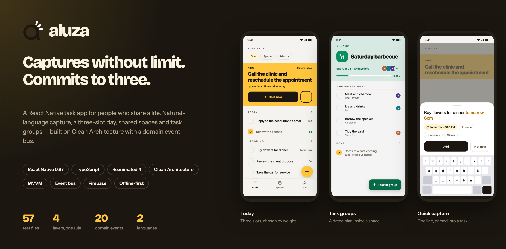
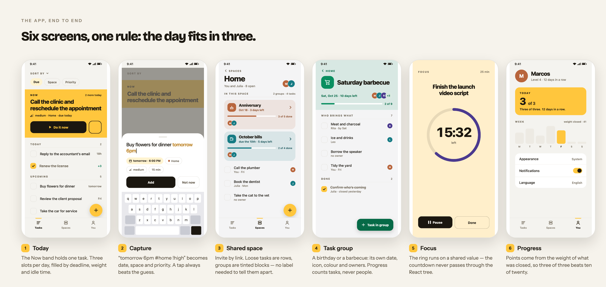

<div align="center">



### Aluza

**A React Native task app that captures without limit and commits to three.**

Clean Architecture · MVVM · domain event bus · offline-first · pt-BR / en-US

[Architecture](docs/ARCHITECTURE.md) · [Decision records](docs/adr) · [Perf baseline](docs/perf/sheets-baseline.md) · [Brand & motion spec](docs/design/identidade-e-telas.html)

</div>

---

## The app, end to end



---

## Why this app exists

Market research came before the first line of code ([`docs/MARKET.md`](docs/MARKET.md)):
**40% of people abandon a to-do app within two weeks**, and what pushes them out
isn't missing features — it's opening the app to forty-seven overdue items.

So the product has one rule, and the architecture enforces it:

| The inbox                             | The day                                                         |
| ------------------------------------- | --------------------------------------------------------------- |
| Accepts everything, in one plain line | Shows **three** tasks, chosen by deadline, weight and idle time |

Closing a task earns points from its **weight**, never from the count — so three
of three beats ten of twenty. `Trio` and `Progress` are domain types, not view
state; the rule survives any redesign of the UI.

---

## Stack

| Concern       | Choice                                          | Why                                                             |
| ------------- | ----------------------------------------------- | --------------------------------------------------------------- |
| Framework     | **React Native 0.87**, React 19.2, TypeScript 6 | Single codebase, native gesture and animation access            |
| Animation     | **Reanimated 4** + `react-native-worklets`      | Per-frame values on the UI thread, never through the React tree |
| Vector UI     | `react-native-svg`, Lottie                      | Progress ring, brand mark, celebration                          |
| Styling       | `styled-components` + a typed theme             | One token source for light and dark                             |
| Local data    | `AsyncStorage` behind typed ports               | Offline-first; the app works with no account                    |
| Auth          | Firebase Auth + Google / Apple Sign-In          | Social sign-in with no password flow to maintain                |
| Cloud         | Firestore, Cloud Functions, Messaging           | Shared spaces and invite links (`functions/invite.js`)          |
| Notifications | **Notifee** + background fetch                  | Deadline reminders scheduled locally, recurrence in the domain  |
| Telemetry     | Firebase Analytics + Crashlytics                | Behind the same ports a console reporter used                   |
| Quality       | ESLint, Prettier, `tsc --noEmit`, Jest          | One gate: `npm run validate`                                    |

---

## Architecture

Feature-sliced Clean Architecture, MVVM inside the presentation layer, and a
domain event bus in the middle. The goal: **product rules know nothing about
React Native, AsyncStorage, or any SDK.**

```
presentation ────────┐
                     ├──> application ───> domain
infrastructure ──────┘

app  ──> presentation + application + infrastructure
shared <── any layer (generic primitives only)
```

```
src/
├── app/                        Composition root: theme, navigation, splash, DI
│   ├── application/ports/      PreferencesStore · CrashReporter
│   │                           AppReviewPrompter · ReviewInvitationStore
│   ├── domain/                 AppPreferences · ReviewInvitation
│   ├── infrastructure/         AsyncStorage · device locale · crash · review
│   └── animation/motion.ts     The whole motion vocabulary, in one file
├── features/
│   ├── tasks/
│   │   ├── domain/             Task · Trio · Progress · QuickCapture
│   │   │                       FocusSession · TaskGroup · TaskList · Reminder
│   │   │                       Workspace · TaskEvent   (pure, no imports)
│   │   ├── application/
│   │   │   ├── ports/          TaskStore · ListStore · ProgressStore · TrioStore
│   │   │   │                   Clock · Haptics · Clipboard · ShareGateway
│   │   │   │                   UsageReporter · ActivityNotifier · …
│   │   │   └── useCases/       captureTask · toggleTask · planDay · editTask
│   │   │                       manageTaskGroup · manageTaskList · shareTaskList
│   │   │                       manageSubtasks · checkProjectActivity · deleteTask
│   │   ├── infrastructure/     storage · clock · haptics · notifications
│   │   │                       sharing · usage · event subscribers
│   │   └── presentation/       screens · views · view-models · models
│   │                           localization (pt-BR, en-US)
│   └── auth/                   Same four layers, Firebase only in infrastructure
└── shared/                     EventBus, createId
```

**A new folder appears only when the first real type of that category does.** No
speculative directories, no barrel files.

### A use case is a pure function

```ts
captureTask(workspace, 'call the accountant friday 9am !high', deps)
  => { workspace, events }
```

It does not save, vibrate, animate, or talk to an SDK. That is what makes the
test suite fast and honest:

> **If a test needs `AsyncStorage`, a real clock, or React, the rule is in the
> wrong layer.**

Parsing vs. tapping is settled explicitly in the domain — _a tap is a decision,
parsing is a guess; when they disagree, the decision wins._

### Events, not orchestration

Completing one task triggers five reactions from five unrelated concerns.
Without a bus, the use case would have to know all five.

```
view (tap) → view-model → use case → domain decides
                                   ↓
                             EventBus.publish
   ┌───────────────┬──────────────┼──────────────┬───────────────┐
persistence     haptics      telemetry     celebration     notifications
```

20 typed facts, in five families: `task.*` (captured, completed, reopened,
edited, deleted, subtasks.changed) · `trio.*` (assembled, completed) ·
`focus.*` (started, finished) · `group.*` (created, edited, deleted) ·
`list.*` (shared, unshared, member.joined, member.removed) · plus
`level.reached`, `screen.opened` and `workspace.committed`.

- Persistence subscribes to `workspace.committed` with a 400 ms debounce and
  writes only the slices whose reference changed. **Saving is a reaction, not a
  chore every use case must remember.**
- A listener that throws can never take the others down — the bus isolates each
  call and reports through `onListenerError`, which is wired to Crashlytics. A
  broken analytics call must not kill the save.
- **A new feature is a new subscriber.** See
  [ADR 0002](docs/adr/0002-barramento-de-eventos.md).

### Why MVVM inside the presentation layer

Clean Architecture says who may import whom; it says nothing about how a screen
is organised. MVVM fills that gap without competing with it: the view-model is
the only place that holds screen state and calls use cases, and the view is a
function of what it receives. The trade-offs — including what _doesn't_ justify
a view-model — are written down in
[ADR 0001](docs/adr/0001-clean-architecture-com-mvvm.md).

### Swapping the platform

Local storage → server is: implement the same ports, change the imports in
`src/app/App.tsx`. Nothing in `domain` or `application` moves. Replacing the
console telemetry reporter with Firebase Analytics was exactly that — one import
line, zero use cases touched.

---

## Decision records

Real trade-offs, written when they were made — [`docs/adr`](docs/adr):

| ADR                                                             | Decision                                                           |
| --------------------------------------------------------------- | ------------------------------------------------------------------ |
| [0001](docs/adr/0001-clean-architecture-com-mvvm.md)            | Clean Architecture with MVVM — and what _doesn't_ justify a layer  |
| [0002](docs/adr/0002-barramento-de-eventos.md)                  | A domain event bus instead of use cases orchestrating side effects |
| [0003](docs/adr/0003-o-dia-cabe-em-tres.md)                     | The day fits in three — the product rule as a domain invariant     |
| [0004](docs/adr/0004-pontos-por-peso.md)                        | Points come from weight, not count                                 |
| [0005](docs/adr/0005-o-projeto-e-compartilhado-o-placar-nao.md) | The project is shared; the scoreboard is not                       |

ADR 0005 is the one I'd bring to an interview: a shared space shows what each
person **closed**, never what they left open. Comparison between people was
designed out of the data model, not hidden in the UI.

> ADRs are written in Portuguese, the language the product ships in. The same
> reasoning is summarised in English in the **Architecture** section above —
> 0001 covers MVVM and what doesn't justify a view-model, 0002 covers the event
> bus, both with the trade-offs that were accepted rather than only the wins.

---

## Performance work

Measured, fixed, measured again — [`docs/perf/sheets-baseline.md`](docs/perf/sheets-baseline.md).
Protocol: `__tests__/sheetOpenPerf.test.tsx`, 3 runs, median, fixed scenario
(8 projects × 6 tasks, 47 rows on screen), `__DEV__` counters per component.

| Sheet open                   | Task rows rendered | Before | After     |
| ---------------------------- | ------------------ | ------ | --------- |
| ShareSheet (Projects)        | 12 → **0**         | 155 ms | **84 ms** |
| JoinInviteSheet (Projects)   | 6 → **0**          | 45 ms  | **5 ms**  |
| QuickCaptureSheet (Projects) | 6 → **0**          | 40 ms  | **6 ms**  |
| QuickCaptureSheet (Tasks)    | 47 → **0**         | 139 ms | **27 ms** |

Same root cause every time: sheet state lived on the screen, so opening a sheet
re-rendered the entire list. Fix: memoized `ProjectBlock` / `ProjectTask` /
`HomeTaskRow` boundaries, so an unrelated tap renders zero task rows.

The document also records what was measured and deliberately **not** fixed —
the ~85 ms first-sheet mount turned out to be module warm-up, not sheet weight.

Also part of the budget:

- Per-frame values (timer ring, press scale, checkmark) live in **shared
  values** and never pass through the React tree.
- Every curve carries `ReduceMotion.System` — a device set to reduce motion is
  honoured without a single screen checking for it.

---

## Testing

**57 test files, 491 assertions**, domain through presentation, all green in
about 21 s:

```bash
npm run validate     # format + lint + typecheck + test
npm test
```

- **Domain** — `trio`, `progress`, `quickCapture`, `focusSession`, `task`,
  `taskGroups`, `reminder`, `subtask`, `taskAssignment`, `sharedDay`
- **Application** — `captureTask`, `toggleTask`, `editTask`, `shareTaskList`,
  `manageTaskList`, `manageSubtasks`, `projectActivity`, `deleteAccount`
- **Infrastructure** — `eventBus`, `persistenceSubscriber`, `deadlineScheduler`,
  `usageTelemetry`, `socialAuth`
- **Presentation** — `quickCaptureSheet`, `listsScreenGroups`, `sharedDayBand`,
  `entranceScreen`, `onboardingScreen`, `profileScreenFlow`, `sheetOpenPerf`
- **Brand** — `brand.test.ts` asserts the mark geometry against
  `MARK_GEOMETRY`, so the logo can't silently drift

---

## Design system

Brand, palette, type scale, the six screens and the motion spec are documented
as a real artifact, not an afterthought:
[`docs/design/identidade-e-telas.html`](docs/design/identidade-e-telas.html) and
[`docs/BRAND.md`](docs/BRAND.md).

- **Aluza** — Portuguese for _it lights up_. The mark is a lowercase `a` with
  three rays; the splash animation morphs the three list lines into those rays.
- The mark is generated, not hand-exported: `npm run brand:assets`
  (`scripts/generate-aluza-mark.py`) draws every iOS, Android, splash and React
  surface from a single `assets/brand/aluza-mark-source.svg`, and
  `brand.test.ts` guards the geometry.
- Two languages ship from day one (`presentation/localization`), including date
  and plural handling — the capture parser reads natural language, so
  localization is a domain concern, not a string table.

---

## Running it

```bash
npm install
npm start
```

In another terminal:

```bash
npm run android
```

iOS — install pods once first:

```bash
cd ios && bundle install && bundle exec pod install && cd ..
npm run ios
```

Release builds:

```bash
npm run android:bundle      # .aab for Play Store
npm run android:build-apk   # .apk
```

Firebase config goes in `.env` — see [`.env.example`](.env.example).
Requires Node ≥ 22.11.

---

## Status

Product slices 1 and 2 shipped: capture, trio, completion, focus, lists, task
groups, progress, reminders, theme, language, social auth, shared spaces with
invite links, account deletion, and Analytics/Crashlytics telemetry. Slice 3 —
full cloud sync of the workspace — is scoped, not built.

Contribution rules and branch naming: [`CONTRIBUTING.md`](CONTRIBUTING.md).

<div align="center">
<sub><a href="docs/ARCHITECTURE.md">Architecture</a> · <a href="docs/adr">ADRs</a> · <a href="docs/perf/sheets-baseline.md">Performance</a></sub>
</div>
